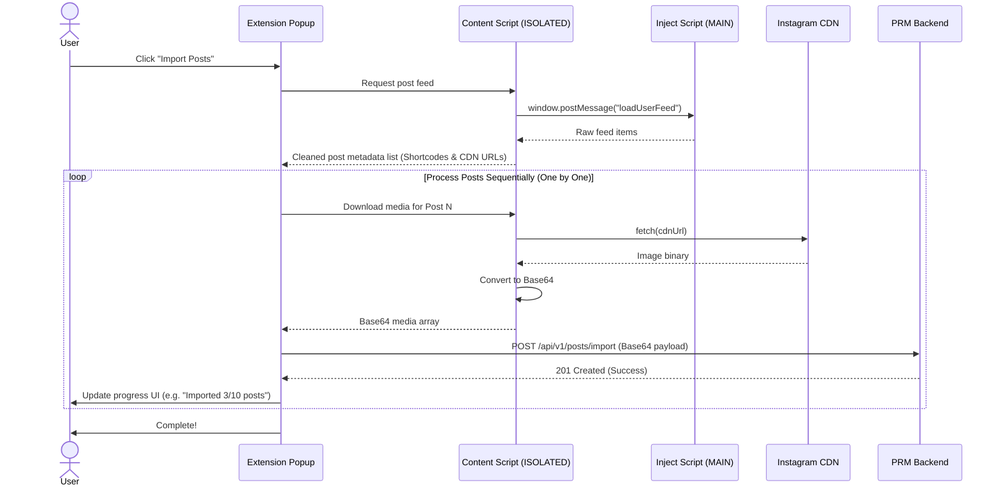

# Instagram Post Import Plan for PRM

This document outlines the design and implementation plan for importing an Instagram user's posts directly to PRM via the Chrome extension.

---

## 1. Design Principles

1. **Browser-side Downloading**: Images will be downloaded directly by the Chrome Extension in the user's browser (converting them to Base64 data URLs) and sent to PRM inside the import request. This avoids backend IP blocks/CORS issues on Instagram's server and ensures the backend doesn't need to fetch raw image URLs from external servers.
2. **Sequential Import (Sets of 1)**: Posts will be scraped, images downloaded, and imported one post at a time. This keeps payload sizes small and manageable.
3. **Authentication**: Requests will use the extension's stored token in the `X-Extension-Token` header.
4. **No Video Playback**: Videos will not be imported. However, video cover thumbnails (stored inside Instagram's standard `image_versions2` field) will be fetched and imported as a single image.

---

## 2. Backend API Endpoint (See PRM-prompt.md)

### Endpoint: `POST /api/v1/posts/import`

- **Headers**:
  - `Content-Type: application/json`
  - `X-Extension-Token: <session_token>`
- **Request Payload**:
  ```json
  {
    "username": "instagram_username",
    "platform": "Instagram",
    "post": {
      "post_id": "3123456789012345678",
      "shortcode": "C8d823xABcd",
      "caption": "Had a great time coding today! #prm",
      "taken_at": 1719182367,
      "media_type": 8,
      "media": [
        {
          "type": "image",
          "filename": "C8d823xABcd_0.jpg",
          "data": "data:image/jpeg;base64,/9j/4AAQSkZJRgABAQEASABIAAD..."
        },
        {
          "type": "image",
          "filename": "C8d823xABcd_1.jpg",
          "data": "data:image/jpeg;base64,/9j/4AAQSkZJRgABAQEASABIAAD..."
        }
      ]
    }
  }
  ```

---

## 3. Popup UI Additions

We will add an **"Import Posts"** button next to the profile scraper.

### DOM Structure (`popup/index.html`):
```html
<button class="btn btn-secondary btn-full" id="import-posts-btn" style="margin-top: 8px; display: none;">
  <svg xmlns="http://www.w3.org/2000/svg" fill="none" viewBox="0 0 24 24" stroke-width="1.5" stroke="currentColor" width="16" height="16">
    <path stroke-linecap="round" stroke-linejoin="round" d="M12 9v6m3-3H9m12 0a9 9 0 1 1-18 0 9 9 0 0 1 18 0Z" />
  </svg>
  Import Posts to PRM
</button>
```

### Display Controller (`popup/js/popup.js`):
Update `detectCurrentPage()` to display `import-posts-btn` when on a valid profile:
```javascript
const { isProfile, username } = checkInstagramProfile(tab.url);
const importPostsBtn = document.getElementById('import-posts-btn');

if (isProfile && username) {
  importPostsBtn.style.display = '';
  importPostsBtn.disabled = false;
} else {
  importPostsBtn.style.display = 'none';
  importPostsBtn.disabled = true;
}
```

---

## 4. Execution Flow in Extension

1. **Click Button**: User clicks "Import Posts to PRM" in the popup.
2. **Fetch Feed Metadata**: Popup requests Content Script (`scraper.js`) to query the Instagram user feed.
3. **RPC to Page Context**: Content script sends a window message to the injected `MAIN` world script (`inject.js`) to call Instagram's API `/api/v1/feed/user/{username}/username/`.
4. **Clean & Filter**: Content script receives raw feed items, maps them, and filters out non-image/video items. If a post is a video, it retains the thumbnail cover image.
5. **Download & Base64 Encode**:
   - For each post, the background script/content script fetches the image URLs from the Instagram CDN.
   - It converts the response to a `Blob`, then reads it as a Base64 data URL.
6. **Send Post Sequentially**:
   - The extension makes a `POST /api/v1/posts/import` call containing the Base64 image payload.
   - Once success is received, it proceeds to the next post.
7. **Display Progress**: The popup shows progress indicators (e.g., `"Imported post 3 of 12..."`).

---

## 5. Flow Diagram


